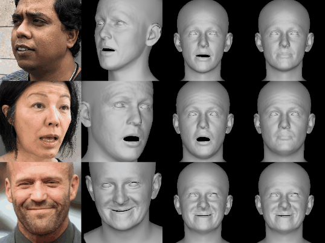
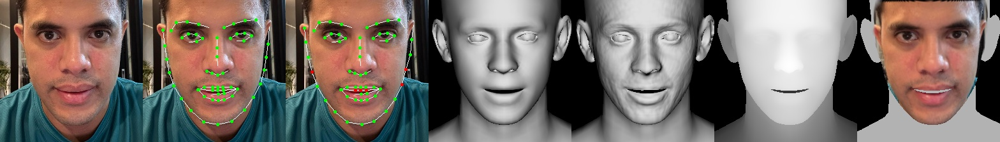
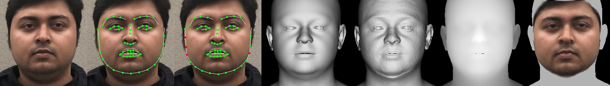

# DECA: Apple Silicon Port (SIGGRAPH2021)

<p align="center"> 

</p>
<p align="center">input image, aligned reconstruction, animation with various poses & expressions<p align="center">

This is a **fork** of the official DECA implementation, refactored to run natively on **Apple Silicon (M1/M2/M3)** using **PyTorch MPS** and removed of all dependencies on **NVIDIA CUDA** and **PyTorch3D**.

### Key Changes in this Fork:
*   **Apple Silicon Support:** Native acceleration via `device='mps'`.
*   **CUDA-Free:** All custom CUDA kernels have been replaced with high-performance C++ CPU fallbacks.
*   **PyTorch3D-Free:** Removed dependencies on the heavy PyTorch3D library, using a custom standard rasterizer instead.
*   **Modern Python:** Updated for Python 3.13 compatibility.
*   **Complete Coordinate Standardization:** Synchronized all components to NDC Y=-1 = Top (PyTorch convention), ensuring robust alignment for detailed renderings and face landmarks.
*   **Deep Dive Article:** Check out [blog.md](file:///Users/mghifary/Work/Code/AI/DECA/blog.md) for a detailed look at the 3D reconstruction math and inference process.

DECA reconstructs a 3D head model with detailed facial geometry from a single input image. The resulting 3D head model can be easily animated. Please refer to the [original arXiv paper](https://arxiv.org/abs/2012.04012) for more details.

The main features:

* **Reconstruction:** produces head pose, shape, detailed face geometry, and lighting information from a single image.
* **Animation:** animate the face with realistic wrinkle deformations.
* **Robustness:** tested on facial images in unconstrained conditions.  Our method is robust to various poses, illuminations and occlusions. 
* **Accurate:** state-of-the-art 3D face shape reconstruction on the [NoW Challenge](https://ringnet.is.tue.mpg.de/challenge) benchmark dataset.
  
## Getting Started
Clone this port:
  ```bash
  git clone https://github.com/ghif/DECA_pt-apple.git
  cd DECA_pt-apple
  ```  

### Requirements
* Python 3.13 (numpy, skimage, scipy, opencv)  
* PyTorch >= 2.10 (Apple Silicon MPS support)  
* face-alignment (Optional for detecting face)  

### Environment Setup (Recommended)
We recommend using [uv](https://github.com/astral-sh/uv) for fast and efficient dependency management.

```bash
# Create a virtual environment named .pt_mps with Python 3.13
uv venv .pt_mps --python 3.13

# Activate the environment
source .pt_mps/bin/activate

# Install dependencies
uv pip install -r requirements.txt
```

For visualization, we use a custom standard rasterizer that uses a C++ CPU extension. This ensures compatibility with Apple Silicon (MPS) and removes dependencies on CUDA or PyTorch3D.

### Usage
1. Prepare data   
    run script: 
    ```bash
    bash fetch_data.sh
    ```
    <!-- or manually download data form [FLAME 2020 model](https://flame.is.tue.mpg.de/download.php) and [DECA trained model](https://drive.google.com/file/d/1rp8kdyLPvErw2dTmqtjISRVvQLj6Yzje/view?usp=sharing), and put them in ./data  -->  
    (Optional for Albedo)   
    follow the instructions for the [Albedo model](https://github.com/TimoBolkart/BFM_to_FLAME) to get 'FLAME_albedo_from_BFM.npz', put it into ./data

2. Run demos  
    a. **reconstruction**  
    ```bash
    python demos/demo_reconstruct.py -i TestSamples/examples --saveDepth True --saveObj True
    ```   
    to visualize the predicted 2D landmanks, 3D landmarks (red means non-visible points), coarse geometry, detailed geometry, and depth.   
    <p align="center">   
    
    </p>  
    <p align="center">   
    
    </p>  
    You can also generate an obj file (which can be opened with Meshlab) that includes extracted texture from the input image.  

    Please run `python demos/demo_reconstruct.py --help` for more details. 

    b. **expression transfer**   
    ```bash
    python demos/demo_transfer.py
    ```   
    Given an image, you can reconstruct its 3D face, then animate it by tranfering expressions from other images. 
    Using Meshlab to open the detailed mesh obj file, you can see something like that:
    <p align="center"> 
    
    </p>  
    (Thank Soubhik for allowing me to use his face ^_^)   
    
    Note that, you need to set '--useTex True' to get full texture.   

    c. **teaser gif (reposing and animation)**
    ```bash
    python demos/demo_teaser.py 
    ``` 
    Generates a full animation preview showing reposing and expression transfer with skin textures:
    <p align="center"> 
    
    </p>

    d. **interactive dashboard (Viser)**
    ```bash
    python demos/demo_viser.py -i TestSamples/examples/ghif_face1.jpg
    ```
    Provides a real-time, web-based interactive dashboard to "dial" expressions, shape, and lighting. It uses the `viser` library to provide a fluid 3D preview of the reconstruction.
    
    More demos and training code coming soon.

## Evaluation
DECA (ours) achieves 9% lower mean shape reconstruction error on the [NoW Challenge](https://ringnet.is.tue.mpg.de/challenge) dataset compared to the previous state-of-the-art method.  
The left figure compares the cumulative error of our approach and other recent methods (RingNet and Deng et al. have nearly identitical performance, so their curves overlap each other). Here we use point-to-surface distance as the error metric, following the NoW Challenge.  
<p align="left"> 

</p>

For more details of the evaluation, please check our [arXiv paper](https://arxiv.org/abs/2012.04012). 

## Training
1. Prepare Training Data

    a. Download image data  
    In DECA, we use [VGGFace2](https://arxiv.org/pdf/1710.08092.pdf), [BUPT-Balancedface](http://www.whdeng.cn/RFW/Trainingdataste.html) and [VoxCeleb2](https://www.robots.ox.ac.uk/~vgg/data/voxceleb/vox2.html)  

    b. Prepare label  
    [FAN](https://github.com/1adrianb/2D-and-3D-face-alignment) to predict 68 2D landmark  
    [face_segmentation](https://github.com/YuvalNirkin/face_segmentation) to get skin mask  

    c. Modify dataloader   
    Dataloaders for different datasets are in decalib/datasets, use the right path for prepared images and labels. 

2. Download face recognition trained model  
    We use the model from [VGGFace2-pytorch](https://github.com/cydonia999/VGGFace2-pytorch) for calculating identity loss,
    download [resnet50_ft](https://drive.google.com/file/d/1A94PAAnwk6L7hXdBXLFosB_s0SzEhAFU/view),
    and put it into ./data  

3. Start training

    Train from scratch: 
    ```bash
    python main_train.py --cfg configs/release_version/deca_pretrain.yml 
    python main_train.py --cfg configs/release_version/deca_coarse.yml 
    python main_train.py --cfg configs/release_version/deca_detail.yml 
    ```
    In the yml files, write the right path for 'output_dir' and 'pretrained_modelpath'.  
    You can also use [released model](https://drive.google.com/file/d/1rp8kdyLPvErw2dTmqtjISRVvQLj6Yzje/view) as pretrained model, then ignor the pretrain step.

## Related works:  
* for better emotion prediction: [EMOCA](https://github.com/radekd91/emoca)  
* for better skin estimation: [TRUST](https://github.com/HavenFeng/TRUST)

## Citation
If you find our work useful to your research, please consider citing:
```
@inproceedings{DECA:Siggraph2021,
  title={Learning an Animatable Detailed {3D} Face Model from In-The-Wild Images},
  author={Feng, Yao and Feng, Haiwen and Black, Michael J. and Bolkart, Timo},
  journal = {ACM Transactions on Graphics, (Proc. SIGGRAPH)}, 
  volume = {40}, 
  number = {8}, 
  year = {2021}, 
  url = {https://doi.org/10.1145/3450626.3459936} 
}
```

<!-- ## Notes
1. Training code will also be released in the future. -->

## License
This code and model are available for non-commercial scientific research purposes as defined in the [LICENSE](https://github.com/YadiraF/DECA/blob/master/LICENSE) file.
By downloading and using the code and model you agree to the terms in the [LICENSE](https://github.com/YadiraF/DECA/blob/master/LICENSE). 

## Acknowledgements
For functions or scripts that are based on external sources, we acknowledge the origin individually in each file.  
Here are some great resources we benefit:  
- [FLAME_PyTorch](https://github.com/soubhiksanyal/FLAME_PyTorch) and [TF_FLAME](https://github.com/TimoBolkart/TF_FLAME) for the FLAME model  
- [Pytorch3D](https://pytorch3d.org/), [neural_renderer](https://github.com/daniilidis-group/neural_renderer), [SoftRas](https://github.com/ShichenLiu/SoftRas) for rendering  
- [kornia](https://github.com/kornia/kornia) for image/rotation processing  
- [face-alignment](https://github.com/1adrianb/face-alignment) for cropping   
- [FAN](https://github.com/1adrianb/2D-and-3D-face-alignment) for landmark detection
- [face_segmentation](https://github.com/YuvalNirkin/face_segmentation) for skin mask
- [VGGFace2-pytorch](https://github.com/cydonia999/VGGFace2-pytorch) for identity loss  

We would also like to thank other recent public 3D face reconstruction works that allow us to easily perform quantitative and qualitative comparisons :)  
[RingNet](https://github.com/soubhiksanyal/RingNet), 
[Deep3DFaceReconstruction](https://github.com/microsoft/Deep3DFaceReconstruction/blob/master/renderer/rasterize_triangles.py), 
[Nonlinear_Face_3DMM](https://github.com/tranluan/Nonlinear_Face_3DMM),
[3DDFA-v2](https://github.com/cleardusk/3DDFA_V2),
[extreme_3d_faces](https://github.com/anhttran/extreme_3d_faces),
[facescape](https://github.com/zhuhao-nju/facescape)
<!-- 3DMMasSTN, DenseReg, 3dmm_cnn, vrn, pix2vertex -->